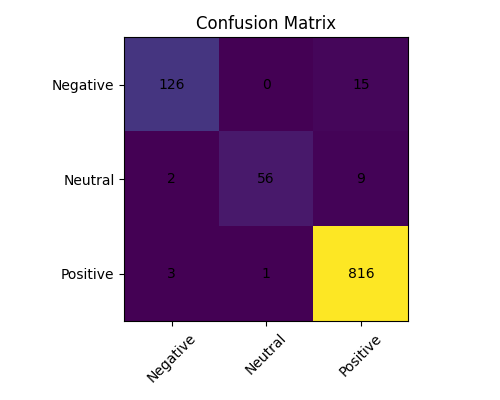
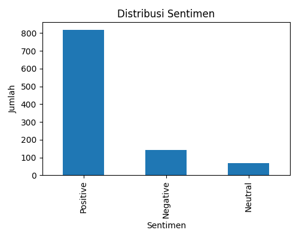

# Sentiment Analysis Web Application (Flask + SVM)
A web-based sentiment analysis application built using Flask and a pre-trained Support Vector Machine (SVM) model.

## Overview
This application allows users to input tourism review text and receive sentiment classification results. The backend loads a trained SVM pipeline model for text processing and prediction.

## Features
- User text input
- Real-time sentiment prediction
- Pre-trained SVM model
- Flask backend integration

## Tech Stack
- Python
- Flask
- Scikit-learn
- SVM (Support Vector Machine)
- HTML & CSS

## Project Structure
- app.py → Main Flask application
- templates/ → HTML templates
- static/ → CSS and assets
- svm_sentiment_pipeline.pkl → Trained ML model
- requirements.txt → Project dependencies

## How to Run
1. Install dependencies:
   pip install -r requirements.txt

2. Run:
   python app.py

## Preview

